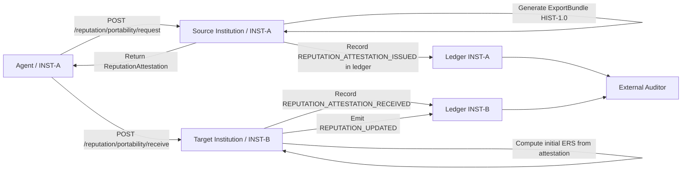

# ACP-REP-PORTABILITY-1.0 — Cross-Organizational Reputation Portability

**Version:** 1.0
**Status:** Active
**Dependencies:** ACP-REP-1.2, ACP-ITA-1.1, ACP-HIST-1.0, ACP-LEDGER-1.2, ACP-SIGN-1.0
**Implements:** ACP-CONF-1.1 Conformance Level L4
**Implements:** ACP-REP-1.1 §12.1 (Inter-institutional reputation federation)
**Related:** ACP-CROSS-ORG-1.0

---

## Abstract

ACP-REP-PORTABILITY-1.0 defines the bilateral protocol by which an agent's reputation history can be transported from its home institution (source) to a foreign institution (target), without requiring the target to trust the source institution unconditionally and without revealing the full internal behavioral history.

This specification closes the gap identified in ACP-REP-1.1 §12.1 ("Inter-institutional reputation federation") and partially addressed in ACP-REP-1.2 (Dual Trust Bootstrap). Where REP-1.2 provides a one-directional vouching mechanism (institution vouches for agent at agent's request), this specification provides the complete bilateral exchange: a formal `ReputationAttestation` format, a query protocol, a verification procedure, and the rules governing how the target institution computes its initial ERS from the attestation.

The privacy guarantee is preserved: the target institution receives a signed numeric score and a set of event references, not the full behavioral history. The audit guarantee is preserved: the attestation can be independently verified against the source institution's ledger via HIST-1.0.

---

## 1. Scope

This document defines:

- The `ReputationAttestation` format and its fields
- The bilateral request/response protocol for reputation portability
- How the target institution verifies and consumes an attestation
- How the resulting ERS is computed and stored
- The `REPUTATION_ATTESTATION_ISSUED` and `REPUTATION_ATTESTATION_RECEIVED` ledger events
- The query endpoints for attestation lifecycle management
- Conformance requirements

This document does **not** define:
- The internal trust score (ITS) computation model (see ACP-REP-1.2)
- The Dual Trust Bootstrap mechanism (see ACP-REP-1.2 §10)
- ZK-proof based decentralized oracle scoring (future: ACP-REP-ORACLE)
- Staking-based external verifier reputation (future: ACP-REP-1.1 §12.2)

---

## 2. Terminology

**ReputationAttestation:** A signed document issued by the source institution attesting the agent's `ExternalReputationScore` at a specific point in time, backed by verifiable ledger references.

**ExternalReputationScore (ERS):** As defined in ACP-REP-1.2. The agent's reputation in the cross-institutional ecosystem, portable under the conditions defined in this specification.

**InternalTrustScore (ITS):** As defined in ACP-REP-1.2. The agent's internal reputation within its home institution. Never directly transmitted — only the derived ERS is exported.

**AttestationScore:** The numeric value in the `ReputationAttestation`. Derived from the agent's ERS at attestation time. Subject to a maximum ceiling (see §5).

**PortabilityRequest:** A request from an agent (or its target institution) to the source institution to issue a `ReputationAttestation`.

**AttestationVerification:** The process by which the target institution validates a `ReputationAttestation` before incorporating its score into its local ERS calculation.

---

## 3. Design Principles

**Institutional sovereignty:** The source institution controls what score it attests. The target institution controls how it uses the attestation. Neither institution can force the other's hand.

**Privacy-preserving:** The attestation contains a numeric score and event references, not behavioral details. The target institution cannot reconstruct the internal score history from the attestation alone.

**Independently verifiable:** The `references` field contains LEDGER-1.2 event IDs. The target institution can verify attestation integrity without trusting the source institution — it can request the referenced events via HIST-1.0 ExportBundle and verify the hash chain independently.

**Temporally bounded:** All attestations have `valid_from` / `valid_to`. A score from 3 years ago does not grant current privileges. This preserves ACP-REP-1.2's decay model across institutional boundaries.

**Non-transitive:** An attestation from INST-A to INST-B does not authorize INST-B to re-attest the same score to INST-C. Re-attestation is prohibited. Each institution attests from its own ledger.

---

## 4. ReputationAttestation Format

### 4.1 Schema

```json
{
  "attestation_id": "<uuid_v4>",
  "attestation_version": "1.0",
  "agent_id": "AGT-001",
  "source_institution_id": "INST-A",
  "target_institution_id": "INST-B",
  "external_score": 0.83,
  "score_components": {
    "its_at_issuance": 0.91,
    "ers_at_issuance": 0.74,
    "event_count": 138,
    "evaluation_window_days": 180
  },
  "valid_from": "2026-03-11T00:00:00Z",
  "valid_to": "2026-09-11T00:00:00Z",
  "issued_at": "2026-03-11T12:00:00Z",
  "references": [
    "evt-987-REPUTATION_UPDATED",
    "evt-654-LIABILITY_RECORD",
    "evt-321-REPUTATION_UPDATED"
  ],
  "export_bundle_url": "https://inst-a.example.com/acp/v1/audit/export/<bundle_id>",
  "non_transitive": true,
  "signature": "base64url_ed25519_sig_INST_A_ARK_over_canonical_attestation"
}
```

### 4.2 Field Definitions

| Field | Type | Required | Description |
|-------|------|----------|-------------|
| `attestation_id` | string (UUID v4) | ✓ | Unique identifier for this attestation. |
| `attestation_version` | string | ✓ | Always `"1.0"` for this spec version. |
| `agent_id` | string | ✓ | ACP agent ID (`base58(SHA-256(pubkey))`) per ACP-SIGN-1.0. |
| `source_institution_id` | string | ✓ | Institution that owns the agent's primary reputation record. |
| `target_institution_id` | string | ✓ | Institution for which this attestation is issued. An attestation is single-use per target. |
| `external_score` | float [0.0, 1.0] | ✓ | Attested score. Subject to ceiling (§5.2). This is the value the target institution uses. |
| `score_components` | object | ✓ | Non-binding breakdown for transparency. See §4.3. |
| `valid_from` | string (ISO 8601) | ✓ | Attestation effective start. |
| `valid_to` | string (ISO 8601) | ✓ | Attestation expiry. Maximum duration: 180 days. |
| `issued_at` | string (ISO 8601) | ✓ | Timestamp of issuance. MUST be ≤ `valid_from`. |
| `references` | array[string] | ✓ | Minimum 5 event IDs from the source ledger (mix of `REPUTATION_UPDATED` and `LIABILITY_RECORD`). Each ID must be verifiable via HIST-1.0. |
| `export_bundle_url` | string (URL) | ✓ | HIST-1.0 export endpoint returning an ExportBundle containing the referenced events. URL MUST be accessible to the target institution during verification window. |
| `non_transitive` | boolean | ✓ | Always `true`. Target institution cannot re-attest this score onward. |
| `signature` | string | ✓ | Ed25519 signature over JCS-canonical attestation (excluding the `signature` field itself), signed with source institution's ARK. |

### 4.3 Score Components (transparency block)

The `score_components` object is not binding — the `external_score` is the authoritative value. Its purpose is to give the target institution visibility into how the score was derived:

| Field | Description |
|-------|-------------|
| `its_at_issuance` | Agent's ITS at time of attestation issuance. |
| `ers_at_issuance` | Agent's ERS at time of attestation issuance. |
| `event_count` | Number of scored events in the evaluation window. |
| `evaluation_window_days` | Duration of the window used to compute the score. |

---

## 5. Attestation Score Derivation

### 5.1 Base computation

The `external_score` in the attestation is computed as:

```
attestation_score = 0.6 · its_at_issuance + 0.4 · ers_at_issuance
```

This matches the ACP-REP-1.2 composite formula. The attestation score represents the agent's full dual-trust composite at issuance time.

### 5.2 Ceiling

To prevent gaming via attestation chains, a ceiling applies:

```
external_score ≤ 0.85
```

An agent with a perfect internal + external record (composite = 1.0) will be attested at most as 0.85. This ceiling:
- Ensures the target institution's own observation retains signal value
- Prevents "reputation laundering" (an institution inflating scores to grant excessive privileges elsewhere)
- Leaves room for the target's own ERS to accumulate from actual observed behavior

### 5.3 Minimum eligibility

A source institution MUST NOT issue an attestation for an agent that does not meet:

```
event_count ≥ 10    AND
its_at_issuance ≥ 0.50
```

An agent with insufficient history or below-threshold internal score cannot be attested. This aligns with ACP-REP-1.2 §10's bootstrap eligibility rules.

---

## 6. Protocol: PortabilityRequest → Attestation Issuance

### 6.1 Request flow

An agent (or the target institution on the agent's behalf) sends a `PortabilityRequest` to the source institution:

```
POST /acp/v1/reputation/portability/request
Authorization: <agent PoP token, ACP-HP-1.0>
Content-Type: application/json

{
  "agent_id": "AGT-001",
  "target_institution_id": "INST-B",
  "requested_valid_from": "2026-03-11T00:00:00Z",
  "requested_valid_to": "2026-09-11T00:00:00Z"
}
```

### 6.2 Source institution processing

Upon receiving a `PortabilityRequest`, the source institution MUST:

1. **Verify agent identity:** validate the PoP token binding to `agent_id` per ACP-HP-1.0.
2. **Verify agent eligibility:** check `event_count ≥ 10` and `its_at_issuance ≥ 0.50` (§5.3).
3. **Verify federation:** confirm active federation between source and `target_institution_id` via ACP-ITA-1.1.
4. **Check for existing valid attestation:** if a non-expired attestation for this `(agent_id, target_institution_id)` pair already exists, return it (idempotent).
5. **Compute `attestation_score`:** per §5.1 and §5.2.
6. **Select `references`:** choose minimum 5 recent `REPUTATION_UPDATED` or `LIABILITY_RECORD` events from the agent's history.
7. **Generate ExportBundle:** via `POST /acp/v1/audit/export` (HIST-1.0), filtered to the selected references.
8. **Issue attestation:** sign with source ARK, record in ledger as `REPUTATION_ATTESTATION_ISSUED`.

### 6.3 Response

```json
{
  "status": "issued",
  "attestation": { "<full ReputationAttestation>" },
  "export_bundle_url": "https://inst-a.example.com/acp/v1/audit/export/bundle-xyz",
  "ledger_event_id": "<REPUTATION_ATTESTATION_ISSUED event_id>"
}
```

---

## 7. Protocol: Attestation → Target Institution Verification

### 7.1 Receiving an attestation

The agent presents the `ReputationAttestation` to the target institution via:

```
POST /acp/v1/reputation/portability/receive
Authorization: <agent PoP token, ACP-HP-1.0>
Content-Type: application/json

{
  "agent_id": "AGT-001",
  "attestation": { "<full ReputationAttestation>" }
}
```

### 7.2 Target institution verification steps

The target institution MUST execute all of the following in order:

1. **Verify expiry:** `valid_to` MUST be in the future. Expired attestations are rejected (PORT-006).
2. **Verify federation:** `GET /ita/v1/federation/resolve/{source_institution_id}` — confirm active federation. (PORT-007 if not found.)
3. **Verify signature:** validate `signature` against source institution's ARK (obtained via ITA-1.1). (PORT-008 if invalid.)
4. **Verify `non_transitive: true`:** reject any attestation where this field is absent or `false`. (PORT-009.)
5. **Verify target match:** `target_institution_id` in attestation MUST match this institution's ID. (PORT-010.)
6. **Verify references (optional but RECOMMENDED):** request ExportBundle from `export_bundle_url`, verify event integrity per HIST-1.0 §7. (PORT-011 if verification fails.)
7. **Check idempotency:** if attestation with `attestation_id` was already processed, return 200 OK with existing result.
8. **Record `REPUTATION_ATTESTATION_RECEIVED`** event in target ledger.
9. **Compute initial ERS** per §7.3.
10. **Emit `REPUTATION_UPDATED`** event in target ledger with new ERS.

### 7.3 Computing initial ERS from attestation

The target institution uses the attestation score as the **initial ERS seed** for the agent, subject to a discount:

```
discount_factor = 1 - (1 / (1 + event_count_in_references / 10))
initial_ers = attestation.external_score * discount_factor * 0.85
```

Where:
- `event_count_in_references` = number of entries in `references` field
- The `0.85` outer ceiling ensures the attested score never pre-empts locally observed behavior
- `discount_factor` grows toward 1 as evidence volume increases

**Example:**
```
attestation.external_score = 0.83
event_count_in_references = 20
discount_factor = 1 - (1 / (1 + 20/10)) = 1 - (1/3) = 0.667
initial_ers = 0.83 * 0.667 * 0.85 = 0.470
```

The initial ERS `0.470` seeds the agent's reputation at the target institution. From this point, ACP-REP-1.2's standard scoring loop applies: each subsequent `LIABILITY_RECORD` event updates the ERS.

---

## 8. Full Example

### 8.1 Complete flow: Agent 001 moves from INST-A to INST-B

```
[INST-A: source ledger]
seq 200: REPUTATION_ATTESTATION_ISSUED → att_id: "att-c9d8..."

[Agent 001]
Presents attestation to INST-B

[INST-B: target ledger]
seq 14: REPUTATION_ATTESTATION_RECEIVED → att_id: "att-c9d8..."
seq 15: REPUTATION_UPDATED → new ERS = 0.470 (seeded from attestation)

[Subsequent at INST-B]
seq 27: LIABILITY_RECORD → execution by AGT-001
seq 28: REPUTATION_UPDATED → ERS updated by INST-B's own REP-1.2 engine
```

### 8.2 Complete ReputationAttestation JSON

```json
{
  "attestation_id": "att-c9d8-4e7f-8a2b-123456789012",
  "attestation_version": "1.0",
  "agent_id": "AGT-001",
  "source_institution_id": "INST-A",
  "target_institution_id": "INST-B",
  "external_score": 0.83,
  "score_components": {
    "its_at_issuance": 0.91,
    "ers_at_issuance": 0.74,
    "event_count": 138,
    "evaluation_window_days": 180
  },
  "valid_from": "2026-03-11T00:00:00Z",
  "valid_to": "2026-09-11T00:00:00Z",
  "issued_at": "2026-03-11T12:00:00Z",
  "references": [
    "evt-987-REPUTATION_UPDATED",
    "evt-654-LIABILITY_RECORD",
    "evt-543-REPUTATION_UPDATED",
    "evt-432-LIABILITY_RECORD",
    "evt-321-REPUTATION_UPDATED"
  ],
  "export_bundle_url": "https://inst-a.example.com/acp/v1/audit/export/bundle-xyz",
  "non_transitive": true,
  "signature": "base64url_ed25519_sig_INST_A_ARK_over_canonical_attestation"
}
```

---

## 9. Interaction Flow



---

## 10. Ledger Events

### 10.1 `REPUTATION_ATTESTATION_ISSUED` (source ledger)

```json
{
  "event_type": "REPUTATION_ATTESTATION_ISSUED",
  "payload": {
    "attestation_id": "att-c9d8-...",
    "agent_id": "AGT-001",
    "target_institution_id": "INST-B",
    "external_score": 0.83,
    "valid_from": "2026-03-11T00:00:00Z",
    "valid_to": "2026-09-11T00:00:00Z",
    "references_count": 5
  }
}
```

### 10.2 `REPUTATION_ATTESTATION_RECEIVED` (target ledger)

```json
{
  "event_type": "REPUTATION_ATTESTATION_RECEIVED",
  "payload": {
    "attestation_id": "att-c9d8-...",
    "agent_id": "AGT-001",
    "source_institution_id": "INST-A",
    "attested_score": 0.83,
    "computed_initial_ers": 0.470,
    "verification_steps_passed": 9,
    "references_verified": true
  }
}
```

Both event types follow the ACP-LEDGER-1.2 envelope and are hash-chained normally. A LEDGER-1.2 v1.0 verifier that encounters these types MUST apply rule LEDGER-008 (unknown type, continue chain).

---

## 11. Query Endpoints

### 11.1 List attestations issued by this institution

```
GET /acp/v1/reputation/portability/issued
```

Parameters: `agent_id`, `target_institution_id`, `status` (active|expired|revoked), `page`, `limit`.

### 11.2 List attestations received by this institution

```
GET /acp/v1/reputation/portability/received
```

Parameters: `agent_id`, `source_institution_id`, `status`, `page`, `limit`.

### 11.3 Get specific attestation

```
GET /acp/v1/reputation/portability/attestations/{attestation_id}
```

### 11.4 Revoke an attestation

```
DELETE /acp/v1/reputation/portability/attestations/{attestation_id}
```

A source institution may revoke an outstanding attestation. Upon revocation:
- The attestation is marked `status: revoked` in the source ledger.
- A `REPUTATION_ATTESTATION_REVOKED` event is emitted in the source ledger.
- The target institution is notified via ACP-NOTIFY-1.0.
- The target institution MUST stop using the attestation score as a positive input; the agent's ERS at the target institution falls back to locally observed behavior only.

---

## 12. Privacy Model

**What the target institution sees:**
- A numeric score (`external_score`)
- A set of event IDs (opaque to the target without source ledger access)
- Score components (non-binding transparency block)
- Validity window

**What the target institution does NOT see:**
- Individual behavioral records
- Full ITS computation history
- Capability tokens or delegation chains
- Internal risk evaluations

**What remains private:**
- The agent's full behavioral history at INST-A
- Any information that could allow INST-B to reconstruct ITS independently

**Auditability:** A regulator with access to both ledgers and the ExportBundle can reconstruct the complete provenance chain (ITS → attestation_score → initial_ERS at INST-B → ERS evolution). This is the same auditor model as AGS-1.0 §7.4.

---

## 13. Error Codes

| Code | HTTP | Description |
|------|------|-------------|
| PORT-001 | 400 | Malformed request: missing required field. |
| PORT-002 | 400 | `valid_to` exceeds maximum duration of 180 days. |
| PORT-003 | 403 | Agent `event_count < 10`: insufficient history for attestation. |
| PORT-004 | 403 | Agent `its_at_issuance < 0.50`: below minimum threshold for attestation. |
| PORT-005 | 403 | Re-attestation prohibited: `target_institution_id` is attempting to re-attest a received attestation. |
| PORT-006 | 410 | Attestation expired (`valid_to` is in the past). |
| PORT-007 | 403 | No active federation between source and target institutions (ITA-1.1). |
| PORT-008 | 422 | Attestation signature verification failed. |
| PORT-009 | 422 | `non_transitive` is absent or `false`: attestation rejected. |
| PORT-010 | 403 | `target_institution_id` in attestation does not match receiving institution. |
| PORT-011 | 422 | ExportBundle reference verification failed: one or more referenced events could not be verified. |
| PORT-012 | 409 | Attestation with `attestation_id` already processed (idempotent). |
| PORT-013 | 404 | Agent not found in source institution's registry. |

---

## 14. Conformance Requirements

A conformant ACP-REP-PORTABILITY-1.0 implementation:

**MUST:**
- Implement `POST /acp/v1/reputation/portability/request` with all steps in §6.2
- Enforce eligibility gates (§5.3) before issuing
- Apply the score ceiling `external_score ≤ 0.85` (§5.2)
- Set `non_transitive: true` on all issued attestations
- Implement `POST /acp/v1/reputation/portability/receive` with all 10 verification steps in §7.2
- Compute initial ERS using the formula in §7.3
- Emit `REPUTATION_ATTESTATION_ISSUED` and `REPUTATION_ATTESTATION_RECEIVED` ledger events (§10)
- Emit `REPUTATION_UPDATED` event after successful receive
- Implement `DELETE /acp/v1/reputation/portability/attestations/{id}` revocation endpoint
- Return all error codes in §13 with correct HTTP status codes

**SHOULD:**
- Verify `export_bundle_url` references during receive (§7.2 step 6)
- Notify target institution of revocation via ACP-NOTIFY-1.0
- Implement list endpoints (§11.1, §11.2)

**MAY:**
- Cache federation resolution (ACP-ITA-1.1 TTL rules apply)
- Implement domain-specific ERS decay rules beyond those in ACP-REP-1.2

---

## 15. Dependencies

```
ACP-REP-PORTABILITY-1.0
├── ACP-REP-1.2              (ERS/ITS model, scoring formulas)
├── ACP-ITA-1.1              (federation verification, ARK resolution)
├── ACP-HIST-1.0             (ExportBundle generation + verification)
├── ACP-LEDGER-1.2           (event envelope, new event types)
├── ACP-HP-1.0               (PoP token for agent identity verification)
├── ACP-SIGN-1.0             (AgentID derivation, Ed25519 signatures)
└── ACP-NOTIFY-1.0           (revocation notifications)
```

---

## 16. Relationship to ACP-REP-1.1 §12

This specification implements §12.1 of ACP-REP-1.1 ("Inter-institutional reputation federation") using a centralized bilateral model rather than a decentralized oracle. The design deliberately scopes to what is feasible with the v1.x infrastructure:

| REP-1.1 §12 concept | This spec |
|---------------------|-----------|
| §12.1 Inter-institutional federation | **Implemented** (this document) |
| §12.2 External verifiers with staking | Not implemented — requires consensus mechanism |
| §12.3 ACP-REP-ORACLE decentralized oracle | Not implemented — future work; ZK-proofs not yet standardized in ACP |

The `ACP-REP-ORACLE` protocol remains future work. This specification provides the production-ready bilateral path that can be deployed today with existing ACP v1.x infrastructure.
