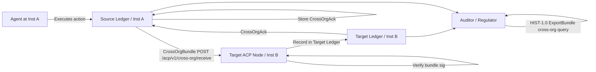

# ACP-CROSS-ORG-1.0 — Cross-Organizational Interaction Registry

**Version:** 1.0
**Status:** Superseded
**Superseded-by:** ACP-CROSS-ORG-1.1
**Archived:** 2026-03-18
**Dependencies:** ACP-LEDGER-1.2, ACP-ITA-1.1, ACP-HIST-1.0, ACP-LIA-1.0, ACP-SIGN-1.0
**Implements:** ACP-CONF-1.1 Conformance Level L4
**Related:** ACP-REP-PORTABILITY-1.0

---

## Abstract

ACP-CROSS-ORG-1.0 defines the `CROSS_ORG_INTERACTION` event type, making cross-system interactions between organizations a first-class, auditable entity in the ACP ledger. Before this specification, cross-institutional actions were implied by `AUTHORIZATION` and `LIABILITY_RECORD` events, but there was no unified, queryable record of the interaction as a bilateral event. This specification closes that gap.

A `CROSS_ORG_INTERACTION` event records the moment a trust boundary is crossed: when an agent authorized under one institution executes an action that produces observable effects in or is directed at a second institution. It is the atomic unit of cross-system auditability.

---

## 1. Scope

This document defines:

- The `CROSS_ORG_INTERACTION` event type and its payload schema
- The rules for emission: who emits, when, and under what conditions
- The bilateral verification protocol: how the target institution validates an incoming interaction
- The query and export extensions on top of ACP-HIST-1.0 for cross-org filtering
- Conformance requirements

This document does **not** define:
- How federation between institutions is established (see ACP-ITA-1.1)
- How reputation is updated from cross-org events (see ACP-REP-PORTABILITY-1.0)
- Payment flows across institutions (see ACP-PAY-1.0)

---

## 2. Terminology

**CROSS_ORG_INTERACTION:** An ACP ledger event emitted when an agent from a source institution executes an action directed at or producing verifiable effects at a target institution.

**CrossOrgBundle:** A signed, self-verifiable package containing one or more `CROSS_ORG_INTERACTION` events, designed to be transmitted to the target institution and stored in its ledger.

**CrossOrgAck:** A signed acknowledgment from the target institution confirming receipt and validation of a CrossOrgBundle. Stored in both ledgers.

**ActionType:** Enumeration of cross-organizational action categories. Extensible; institutions may define domain-specific subtypes prefixed with `x:`.

**PayloadHash:** SHA-256 hash of the canonical representation (JCS, RFC 8785) of the interaction payload. The payload itself is never transmitted — only the hash.

**ZKP:** Zero-knowledge proof, optional field. Allows a source institution to prove a property of the interaction (e.g., "the amount transferred is within regulatory limits") without revealing the full payload.

---

## 3. Motivation

The ACP authorization model is institutional: each institution maintains its own ledger, its own agents, and its own risk evaluation. When two institutions interact, the existing model captures:

- The `AUTHORIZATION` on the source side (source ledger)
- The `LIABILITY_RECORD` on the source side (source ledger)
- Nothing on the target side unless it independently generates events

This creates an **asymmetric audit trail**: the source institution has a complete record, the target has nothing unless it implements custom instrumentation. External auditors and regulators cannot reconstruct the full cross-institutional flow from a single ledger.

`CROSS_ORG_INTERACTION` closes this gap by:

1. Making the interaction explicit in **both** ledgers
2. Providing a **standardized** bilateral verification protocol
3. Creating a **first-class query endpoint** for cross-org events
4. Enabling downstream reputation and liability systems to consume a clean signal

---

## 4. Event Type: `CROSS_ORG_INTERACTION`

### 4.1 Envelope

The event follows the standard ACP-LEDGER-1.2 envelope:

```json
{
  "ver": "1.2",
  "event_id": "<uuid_v4>",
  "event_type": "CROSS_ORG_INTERACTION",
  "sequence": 42,
  "timestamp": "<unix_timestamp_ms>",
  "institution_id": "<source_institution_id>",
  "prev_hash": "<sha256_of_previous_event_canonical>",
  "payload": { ... },
  "sig": "<ed25519_base64url_over_canonical_envelope>"
}
```

The `institution_id` in the envelope is **always the source institution** — the institution whose agent initiated the interaction. The target institution stores this event in its own ledger with its own envelope wrapping the CrossOrgBundle (see §7).

### 4.2 Payload Schema

```json
{
  "event_id": "e7f9c8a1-5b2c-4d3e-987f-1234567890ab",
  "timestamp": "2026-03-11T12:00:00Z",
  "source_institution_id": "INST-A",
  "target_institution_id": "INST-B",
  "action_type": "DATA_SHARE",
  "payload_hash": "a1b2c3d4e5f6a1b2c3d4e5f6a1b2c3d4e5f6a1b2c3d4e5f6a1b2c3d4e5f6a1b2",
  "delegation_chain": [
    {
      "agent_id": "AGT-001",
      "institution_id": "INST-A",
      "capability": "acp:cap:data.share",
      "sig": "base64url(ed25519_sig_over_delegation_step)"
    }
  ],
  "authorization_id": "<uuid_of_AUTHORIZATION_event_in_source_ledger>",
  "liability_record_id": "<uuid_of_LIABILITY_RECORD_in_source_ledger>",
  "proof": "zkp_base64url_encoded_optional_or_null",
  "ack_required": true,
  "metadata": {
    "protocol_version": "1.0",
    "domain": "finance",
    "classification": "confidential"
  }
}
```

### 4.3 Field Definitions

| Field | Type | Required | Description |
|-------|------|----------|-------------|
| `event_id` | string (UUID v4) | ✓ | Globally unique event identifier. Primary key for cross-referencing. |
| `timestamp` | string (ISO 8601) | ✓ | UTC timestamp of interaction initiation. |
| `source_institution_id` | string | ✓ | ACP institution ID of the initiating institution. MUST match the envelope `institution_id`. |
| `target_institution_id` | string | ✓ | ACP institution ID of the receiving institution. MUST be registered in the ITA federation (ACP-ITA-1.1). |
| `action_type` | string (enum) | ✓ | Category of cross-org action. See §4.4. |
| `payload_hash` | string (hex, 64 chars) | ✓ | SHA-256 of the JCS-canonical interaction payload. Payload itself is never transmitted. |
| `delegation_chain` | array | ✓ | Ordered list of delegation steps from root capability to acting agent. Minimum 1 entry. |
| `authorization_id` | string (UUID) | ✓ | UUID of the `AUTHORIZATION` event in the **source** ledger that authorized this interaction. MUST be verifiable. |
| `liability_record_id` | string (UUID) | ✓ | UUID of the `LIABILITY_RECORD` event in the **source** ledger. MUST be emitted before or at the same sequence as this event. |
| `proof` | string \| null | ○ | Optional ZK-proof. Format: `zkp:<scheme>:<base64url_data>`. When present, the target institution MAY use it for compliance verification without accessing the payload. |
| `ack_required` | boolean | ✓ | When `true`, the target institution MUST emit a `CrossOrgAck` and transmit it back. |
| `metadata` | object | ○ | Domain-specific metadata. Keys reserved: `protocol_version`, `domain`, `classification`. |

### 4.4 ActionType Enumeration

| ActionType | Description |
|-----------|-------------|
| `DATA_SHARE` | Source shares data (dataset, report, stream) with target. |
| `SERVICE_INVOCATION` | Source agent invokes a service endpoint at target. |
| `DELEGATION_TRANSFER` | Source transfers a capability delegation to an agent at target. |
| `COMPLIANCE_QUERY` | Source queries regulatory/compliance status at target. |
| `FINANCIAL_SETTLEMENT` | Source initiates a financial settlement directed at target. Requires ACP-PAY-1.0. |
| `AUDIT_REQUEST` | Source requests an audit segment (ExportBundle) from target. |
| `REPUTATION_QUERY` | Source queries agent reputation data at target. See ACP-REP-PORTABILITY-1.0. |
| `x:<custom>` | Institution-defined. MUST be prefixed `x:` to avoid collisions with reserved types. |

---

## 5. Emission Rules

**CROSS-RULE-1:** A `CROSS_ORG_INTERACTION` event MUST be emitted by the **source institution** in its own ledger for every action that crosses an institutional trust boundary, as defined by the active federation (ACP-ITA-1.1).

**CROSS-RULE-2:** The event MUST be emitted **after** the `LIABILITY_RECORD` for the same execution. The `liability_record_id` field MUST reference an event that already exists in the source ledger.

**CROSS-RULE-3:** The `authorization_id` MUST reference an `AUTHORIZATION` event that preceded this interaction in the source ledger. If the `AUTHORIZATION` event cannot be found, emission is prohibited and the interaction MUST be blocked.

**CROSS-RULE-4:** The `payload_hash` MUST be computed over the JCS-canonical form of the full interaction payload before transmission. It is never updated after emission.

**CROSS-RULE-5:** If `ack_required` is `true`, the source institution MUST track the outstanding acknowledgment and escalate via `ESCALATION_CREATED` if no `CrossOrgAck` is received within the configured timeout (default: 300s).

**CROSS-RULE-6:** If a federation between `source_institution_id` and `target_institution_id` does not exist (verified via `GET /ita/v1/federation/resolve/{target_institution_id}`), the event MUST NOT be emitted and MUST return error CROSS-004.

---

## 6. Full Example

### 6.1 Interaction: Institution A shares a data report with Institution B

**Sequence in source ledger (INST-A):**

```
seq 38: AUTHORIZATION    → auth_id: "auth-9a3f..."
seq 39: EXECUTION_TOKEN_CONSUMED → et_id: "et-7c2b..."
seq 40: LIABILITY_RECORD  → lia_id: "lia-5d1e..."
seq 41: CROSS_ORG_INTERACTION → event_id: "e7f9c8a1..."
```

**Full CROSS_ORG_INTERACTION event (seq 41):**

```json
{
  "ver": "1.2",
  "event_id": "e7f9c8a1-5b2c-4d3e-987f-1234567890ab",
  "event_type": "CROSS_ORG_INTERACTION",
  "sequence": 41,
  "timestamp": 1741694400000,
  "institution_id": "INST-A",
  "prev_hash": "9f3bc2a1e4d7890123456789abcdef0123456789abcdef0123456789abcdef01",
  "payload": {
    "event_id": "e7f9c8a1-5b2c-4d3e-987f-1234567890ab",
    "timestamp": "2026-03-11T12:00:00Z",
    "source_institution_id": "INST-A",
    "target_institution_id": "INST-B",
    "action_type": "DATA_SHARE",
    "payload_hash": "a1b2c3d4e5f6a1b2c3d4e5f6a1b2c3d4e5f6a1b2c3d4e5f6a1b2c3d4e5f6a1b2",
    "delegation_chain": [
      {
        "agent_id": "AGT-001",
        "institution_id": "INST-A",
        "capability": "acp:cap:data.share",
        "sig": "base64url_sig_AGT001_over_delegation_step"
      }
    ],
    "authorization_id": "auth-9a3f-4b2c-8d1e-567890abcdef",
    "liability_record_id": "lia-5d1e-4c3b-9a2f-890123abcdef",
    "proof": null,
    "ack_required": true,
    "metadata": {
      "protocol_version": "1.0",
      "domain": "finance",
      "classification": "confidential"
    }
  },
  "sig": "base64url_ed25519_sig_INST_A_over_canonical_event"
}
```

---

## 7. CrossOrgBundle — Bilateral Transmission Protocol

### 7.1 Bundle structure

After emitting the event in the source ledger, the source institution packages it for transmission to the target:

```json
{
  "bundle_id": "<uuid_v4>",
  "bundle_version": "1.0",
  "source_institution_id": "INST-A",
  "target_institution_id": "INST-B",
  "created_at": "2026-03-11T12:00:01Z",
  "events": [
    { "<full CROSS_ORG_INTERACTION event as above>" }
  ],
  "evidence": {
    "authorization_export": "<ExportBundle from HIST-1.0 filtered to auth_id>",
    "liability_export": "<ExportBundle from HIST-1.0 filtered to lia_id>"
  },
  "sig": "base64url_ed25519_sig_INST_A_over_canonical_bundle"
}
```

The `evidence` block is optional but RECOMMENDED. It contains HIST-1.0 ExportBundles allowing the target to independently verify the source ledger events without querying the source's API.

### 7.2 Transmission endpoint

The source institution POSTs the bundle to the target's ACP node:

```
POST /acp/v1/cross-org/receive
Content-Type: application/json

Body: <CrossOrgBundle>
```

### 7.3 Target validation steps

Upon receiving a CrossOrgBundle, the target institution MUST:

1. **Verify federation:** `GET /ita/v1/federation/resolve/{source_institution_id}` — confirm active federation exists.
2. **Verify bundle signature:** validate `sig` against source institution's ARK (obtained via ITA federation).
3. **Verify each event signature:** validate each event's `sig` using the source institution's ARK.
4. **Verify hash chain integrity:** if multiple events in bundle, verify sequential `prev_hash` linkage.
5. **Verify references (optional):** if `evidence.authorization_export` is present, verify ExportBundle integrity per HIST-1.0 §7.
6. **Check idempotency:** if `event_id` already exists in local ledger, return 200 OK (already processed) without duplicating.
7. **Record in local ledger:** emit a `CROSS_ORG_INTERACTION` event in the target's own ledger with `institution_id` = target institution's ID and a reference to the original `event_id`.

### 7.4 CrossOrgAck

If `ack_required` is `true`, the target institution MUST respond with:

```json
{
  "ack_id": "<uuid_v4>",
  "original_event_id": "e7f9c8a1-5b2c-4d3e-987f-1234567890ab",
  "target_institution_id": "INST-B",
  "source_institution_id": "INST-A",
  "validated_at": "2026-03-11T12:00:02Z",
  "status": "accepted",
  "ledger_sequence": 17,
  "sig": "base64url_ed25519_sig_INST_B_over_canonical_ack"
}
```

`status` values: `accepted` | `rejected` (with `rejection_reason`) | `pending_review`.

The source institution MUST store the `CrossOrgAck` in its own ledger as a `CROSS_ORG_ACK` event (sub-type of CROSS_ORG_INTERACTION family).

---

## 8. Interaction Flow



---

## 9. Query Extensions (HIST-1.0)

This specification adds a cross-org filter parameter to the existing `GET /acp/v1/audit/query` endpoint defined in ACP-HIST-1.0:

### New filter parameters

| Parameter | Type | Description |
|-----------|------|-------------|
| `event_type` | string | Set to `CROSS_ORG_INTERACTION` to filter exclusively. |
| `source_institution_id` | string | Filter by source institution. |
| `target_institution_id` | string | Filter by target institution. |
| `action_type` | string | Filter by action type enum (§4.4). |
| `cross_org_status` | string | `acked` / `pending_ack` / `rejected` |

### Cross-org agent history extension

```
GET /acp/v1/audit/agents/{agent_id}/cross-org-history
```

Returns all `CROSS_ORG_INTERACTION` events where the agent in `delegation_chain` participated, across both source and target perspectives.

**Response:**
```json
{
  "agent_id": "AGT-001",
  "cross_org_summary": {
    "total_interactions": 47,
    "as_source": 31,
    "as_target": 16,
    "action_types": {
      "DATA_SHARE": 22,
      "SERVICE_INVOCATION": 15,
      "COMPLIANCE_QUERY": 10
    },
    "institutions_interacted": ["INST-B", "INST-C", "INST-D"]
  },
  "events": [ "..." ]
}
```

### Cross-org export

```
POST /acp/v1/audit/export
```

With body including `event_types: ["CROSS_ORG_INTERACTION", "CROSS_ORG_ACK"]` and optional `target_institution_id` filter. The resulting ExportBundle is independently verifiable per HIST-1.0 §7.

---

## 10. Integration Reference

| Spec | Integration Point |
|------|------------------|
| **ACP-LEDGER-1.2** | `CROSS_ORG_INTERACTION` is an extension event type in the LEDGER-1.2 event taxonomy. Follows the same envelope format, hash chaining, and signature rules. A LEDGER-1.2 v1.0 verifier that encounters this event type MUST apply rule LEDGER-008 (unknown type, continue verifying chain). |
| **ACP-ITA-1.1** | Federation resolution is prerequisite for every emission (§5, CROSS-RULE-6). ARK from ITA-1.1 is used for bundle signature verification (§7.3 step 2). |
| **ACP-HIST-1.0** | Query extensions are additive on top of existing endpoints (§9). ExportBundle format from HIST-1.0 §7 is reused for evidence in CrossOrgBundle (§7.1). |
| **ACP-LIA-1.0** | Every `CROSS_ORG_INTERACTION` MUST reference a `LIABILITY_RECORD` (`liability_record_id` field). The LIA-1.0 record establishes who bears legal responsibility; the CROSS_ORG event records that the interaction crossed an institutional boundary. Together they produce a complete cross-institutional audit chain. |
| **ACP-REP-PORTABILITY-1.0** | `CROSS_ORG_INTERACTION` events with `action_type: REPUTATION_QUERY` trigger the portability protocol. The `REPUTATION_UPDATED` events that result from cross-org interactions feed the ERS calculation in ACP-REP-1.2. |

---

## 11. Error Codes

| Code | HTTP | Description |
|------|------|-------------|
| CROSS-001 | 400 | Malformed event: missing required field. |
| CROSS-002 | 400 | `payload_hash` is not a valid 64-char hex string. |
| CROSS-003 | 400 | `delegation_chain` is empty or contains invalid entry. |
| CROSS-004 | 403 | No active federation between `source_institution_id` and `target_institution_id` (ITA-1.1 check failed). |
| CROSS-005 | 404 | `authorization_id` not found in source ledger. |
| CROSS-006 | 404 | `liability_record_id` not found in source ledger. |
| CROSS-007 | 409 | Event with `event_id` already recorded (idempotent reject). |
| CROSS-008 | 422 | Bundle signature verification failed. |
| CROSS-009 | 422 | Individual event signature verification failed. |
| CROSS-010 | 503 | ITA federation registry unreachable (resolution failed). |
| CROSS-011 | 504 | `ack_required: true` but no `CrossOrgAck` received within timeout. Escalation triggered. |

---

## 12. Conformance Requirements

A conformant ACP-CROSS-ORG-1.0 implementation:

**MUST:**
- Emit `CROSS_ORG_INTERACTION` for every cross-institutional action per §5
- Follow all CROSS-RULE-1 through CROSS-RULE-6 emission rules
- Verify federation before emission (CROSS-RULE-6)
- Implement `POST /acp/v1/cross-org/receive` endpoint (§7.2)
- Perform all 7 validation steps on incoming bundles (§7.3)
- Emit `CrossOrgAck` when `ack_required: true` (§7.4)
- Store `CROSS_ORG_INTERACTION` events in the target ledger upon successful receipt (§7.3 step 7)
- Support `event_type=CROSS_ORG_INTERACTION` filter in HIST-1.0 query endpoint (§9)
- Return all error codes defined in §11 with the specified HTTP status codes

**SHOULD:**
- Include `evidence` block in CrossOrgBundle (§7.1)
- Implement `GET /acp/v1/audit/agents/{agent_id}/cross-org-history` (§9)
- Support `action_type`, `source_institution_id`, `target_institution_id` filters in audit query

**MAY:**
- Include ZKP `proof` field for compliance-sensitive interactions
- Define domain-specific `x:` ActionType extensions
- Implement rate limiting per institution pair (recommended: 1000 rpm per federation)

---

## 13. Dependencies

```
ACP-CROSS-ORG-1.0
├── ACP-LEDGER-1.2        (event envelope, hash chaining)
├── ACP-ITA-1.1           (federation verification)
├── ACP-HIST-1.0          (query layer, ExportBundle)
├── ACP-LIA-1.0           (liability_record_id prerequisite)
└── ACP-SIGN-1.0          (Ed25519 signatures, AgentID derivation)
```
